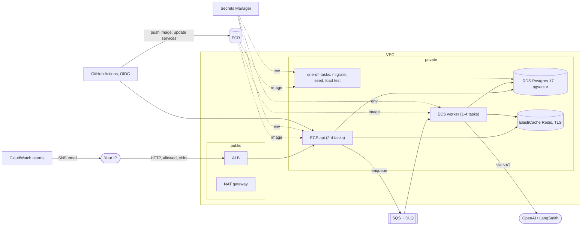

# AWS architecture (F17)

```mermaid
flowchart LR
  you([Your IP]) -->|HTTP, allowed_cidrs| ALB
  subgraph VPC
    subgraph public
      ALB[ALB] 
      NAT[NAT gateway]
    end
    subgraph private
      API["ECS api (2-4 tasks)"]
      WRK["ECS worker (1-4 tasks)"]
      MIG["one-off tasks: migrate, seed, load test"]
      RDS[("RDS Postgres 17 + pgvector")]
      REDIS[("ElastiCache Redis, TLS")]
    end
  end
  ALB --> API
  API -->|enqueue| SQS[["SQS + DLQ"]]
  SQS --> WRK
  API & WRK & MIG --> RDS
  API & WRK --> REDIS
  WRK -->|via NAT| OPENAI([OpenAI / LangSmith])
  ECR[(ECR)] -.image.-> API & WRK & MIG
  SM[Secrets Manager] -.env.-> API & WRK & MIG
  CW[CloudWatch alarms] -->|SNS email| you
  GH[GitHub Actions, OIDC] -->|push image, update services| ECR
  GH --> API
```

Autoscaling: workers follow SQS backlog per task, the API follows CPU. Terraform owns everything except which image runs (`scripts/aws_deploy.sh`).
